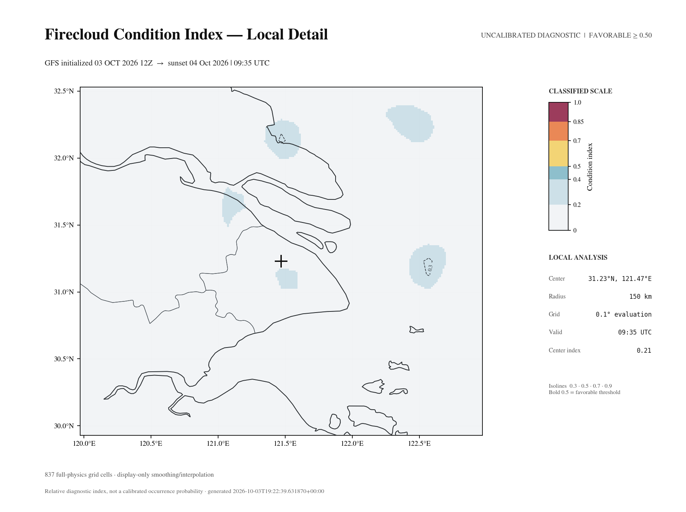

# Firecloud Forecast

**Explainable sunrise and sunset glow forecasts.**

[](https://github.com/NickZhuxy/firecloud-forecast/actions/workflows/tests.yml)
[](LICENSE)

Firecloud combines public weather forecasts, cloud-layer diagnosis, and sunward
illumination geometry to produce national and local maps with traceable metadata.
Its output is a **condition index from 0 to 1**, not a calibrated probability:
`0.8` does not mean an 80% chance of a colorful sky.

This is research software. It provides a Python package and command-line tools;
precomputed maps can be distributed through a static GitHub Pages feed.

**Current coverage:** China has national maps and local maps. New York City has
an experimental local pilot. Coverage will expand to other regions.



*A published Shanghai forecast: GFS initialized October 3 at 12:00 UTC, targeting
the following evening's sunset. Center index: 0.21. This is an archived forecast,
not an observation or an accuracy claim. [Inspect the case and its provenance](examples/shanghai-sunset/README.md).*

Weather data by [Open-Meteo.com](https://open-meteo.com/) ([CC BY 4.0](https://creativecommons.org/licenses/by/4.0/)),
alongside NOAA GFS; transformed into Firecloud's derived diagnostic.
Map context made with Natural Earth.

## The question behind the project

Cloud cover alone cannot describe whether clouds can catch low-angle sunlight.
Firecloud asks a more specific question: **is there a suitable cloud layer, and
can sunlight reach it through the atmosphere toward the horizon?**

The project has grown from a compact scoring prototype into cloud-profile
diagnosis, sunward geometry, local and national products, and a published forecast
feed. The [project story](docs/project-story.md) follows that development through
concrete experiments, mistakes, and design decisions. The research sources remain
available so contributors can inspect how the reasoning evolved.

## Quick start

Requires Python 3.11 or newer and [uv](https://docs.astral.sh/uv/).

```bash
git clone https://github.com/NickZhuxy/firecloud-forecast.git
cd firecloud-forecast
uv sync --frozen
uv run firecloud --help
uv run firecloud --source remote --event sunset
```

The last command downloads a published map if one is available. It fails with
an explanation if the feed is unavailable or stale, without starting a local
weather-data download. The public feed is best-effort and may have coverage gaps.

For a published location forecast without generating national maps:

```bash
uv run firecloud --scope local --source remote --event sunset --lat 31.23 --lon 121.47
```

For an offline introduction that requires only Python and no weather downloads:

```bash
python examples/shanghai-sunset/verify.py
```

This verifies the archived example's checksums and prints its event time, actual
GFS forecast time, and condition index. It does not rerun the weather model or
validate the forecast against observations.

For local computation:

```bash
uv run firecloud --source local --event sunset
```

For a New York City sunset forecast:

```bash
uv run firecloud --region us-nyc --scope local --source local --event sunset \
  --lat 40.7128 --lon -74.0060 --radius 25 --resolution 0.1
```

These are public example coordinates. Select your location with `--lat` and
`--lon`. The pilot accepts centers from 40.0 to 41.5°N and 75.0 to 72.5°W.
It uses the `America/New_York` calendar date, including daylight saving time.
It has no published feed or satellite correction. Its weather path can extend
into Canada and over the ocean. See [the pilot limits](docs/usage.md#new-york-city-pilot).

The first local run downloads GFS subsets and Cartopy map data. Downloads can be
large, and full refinement can take tens of minutes or longer. On macOS, if
native GRIB or mapping libraries are missing, install `eccodes`, `geos`, and
`proj` with Homebrew. See [usage and troubleshooting](docs/usage.md).

## What it does

- Produces national sunrise/sunset maps and optional detailed local maps.
- Reads GFS 0.25° forecasts and diagnoses cloud base, top, phase, and opacity.
- Evaluates the sunward path out to 800 km, including cloud and aerosol obstruction.
- Combines necessary conditions and quality modifiers into an explainable index.
- Saves PNG maps and JSON provenance, timing, and algorithm metadata.
- Supports remote downloads with checksum verification and valid-cache fallback.

The default local path uses GFS profiles and Open-Meteo cloud, humidity, and
visibility forecasts. It does not supply terrain heights or aerosol fields along
each path. These input limits apply to the New York City pilot.

```bash
uv run firecloud                          # Today, both events; remote first
uv run firecloud --event sunrise          # One event
uv run firecloud --lat 31.23 --lon 121.47  # Add local products around Shanghai
uv run firecloud --scope local --lat 31.23 --lon 121.47 --event sunset
uv run firecloud --source local --no-refine --event sunset
```

`--source auto` is the default. If remote products are missing, invalid, or do not
match the requested grid, it falls back to local computation. Use `--source remote`
when you only want published products. Local products default to a 150 km radius
and 0.1° evaluation grid; this finer sampling does **not** increase the resolution
of the underlying GFS model.

Outputs are grouped by date:

```text
output/YYYY-MM-DD/
├── national-sunrise.png
├── national-sunrise.json
├── national-sunset.png
├── national-sunset.json
└── point-31.23_121.47-sunset.png   # Plus JSON, when coordinates are supplied
```

New York City products use `output/us-nyc/YYYY-MM-DD/`. The JSON file records
the event time in local time and UTC. It records the GFS forecast hour separately.

## Documentation

| Guide | Contents |
| --- | --- |
| [Usage](docs/usage.md) | Installation, CLI options, output interpretation, troubleshooting |
| [Example forecast](examples/shanghai-sunset/README.md) | A real map, exact source times, and offline integrity verification |
| [New York City pilot](examples/new-york-sunset/README.md) | A local forecast, model times, input limits, and download measurements |
| [Automatic forecasts](docs/automatic-forecasts.md) | Schedule local forecasts, keep source records, and read the latest result |
| [Optional observations](docs/observation-pilot.md) | Save forecasts and record observations for an optional comparison |
| [Project story](docs/project-story.md) | Development milestones, lessons, and evidence from repository history |
| [Product roadmap](docs/roadmap.md) | Product priorities and checks for each next step |
| [Architecture](docs/architecture.md) | Data flow, package map, contributor invariants |
| [Methodology](research/methodology.md) | Implemented assumptions, scoring, scientific limitations |
| [Static publishing](docs/publishing.md) | Precomputation and GitHub Pages setup |
| [Contributing](CONTRIBUTING.md) | Development setup, tests, and pull requests |
| [Research](research/README.md) | Experiments and the historical paper |

## Repository layout

```text
predictor/              Forecast package and command-line entry points
  tests/                Synthetic, regression, and opt-in network tests
docs/                   User and developer guides
examples/               Small, documented forecast snapshots with provenance
research/
  experiments/          Reproducible research scripts
  paper/                Historical LaTeX case study and figure sources
  methodology.md        Current implementation guide
.github/                Test/publishing workflows and contribution templates
```

Downloaded grids, routine forecast output, private reference documents, and personal
planning archives stay outside version control. The lockfile, small paper figures,
and a bounded documented forecast example remain tracked for reproducibility. Internal implementation diaries have
been replaced by focused public guides; their originals remain in Git history.

## Scientific status

The score is an uncalibrated heuristic. Cloud boundaries, aerosol structure,
terrain, and event timing are uncertain at model resolution. Offline regression
and physical-consistency tests check software behavior; they do not establish
real-world forecast skill. Satellite-related modules are experimental and their
availability must be checked in product metadata. This is not a full spectral
radiative-transfer model, and it does not predict exact sky colors.

Some Python fields retain historical names such as `probability` for compatibility;
interpret them as condition indices. The legacy `label_zh` localization field is
also retained, while public documentation and command-line output use English.

## Contributing and next steps

Bug reports, reproducible forecast cases, documentation improvements, and
independent validation are welcome. Start with [CONTRIBUTING.md](CONTRIBUTING.md)
and the [issue tracker](https://github.com/NickZhuxy/firecloud-forecast/issues).
Planning lives on the [project board](https://github.com/users/NickZhuxy/projects/2).

Current product work focuses on automatic local forecasts and clear result reports.
See the [product roadmap](docs/roadmap.md) for the next steps and acceptance criteria.
Independent forecast evaluation remains a research goal.
Webcam collection and machine-learning validation are on hold.
Algorithm changes need a separate review.

## License

Licensed under the [MIT License](LICENSE).
Weather data, maps, and third-party references have their own terms; see
[data sources](docs/data-sources.md).
