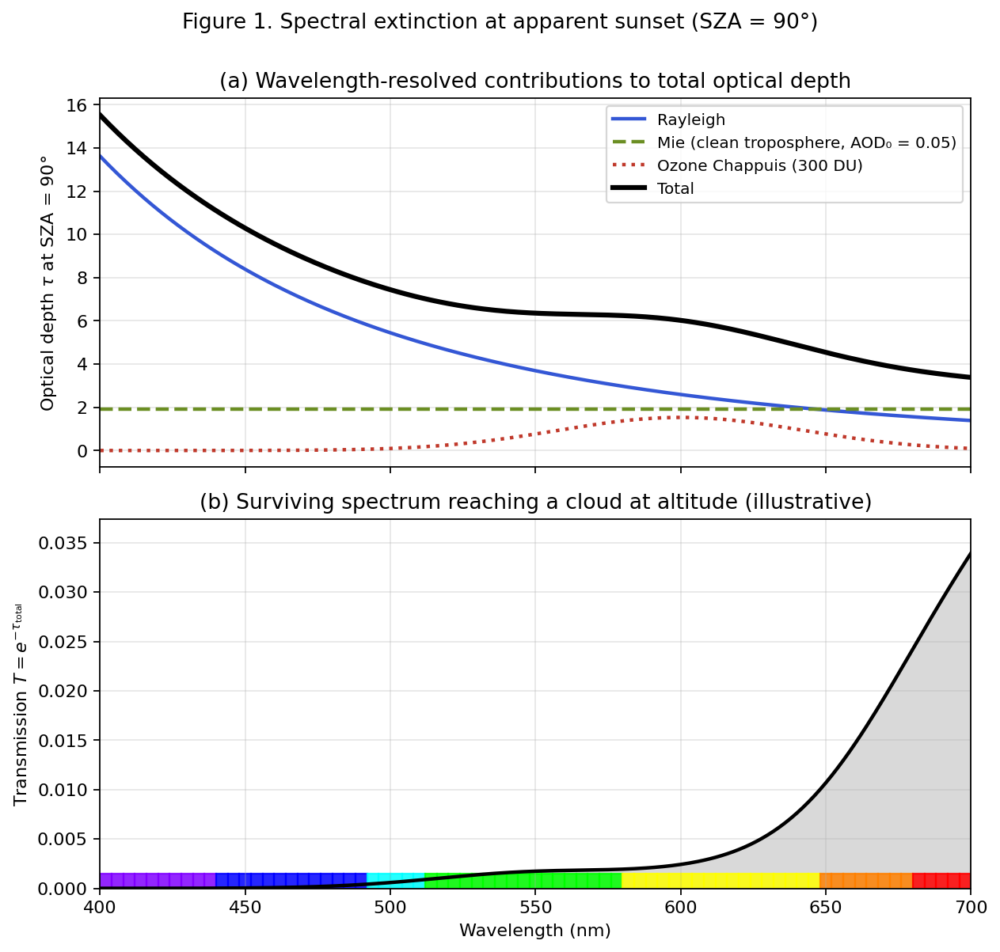
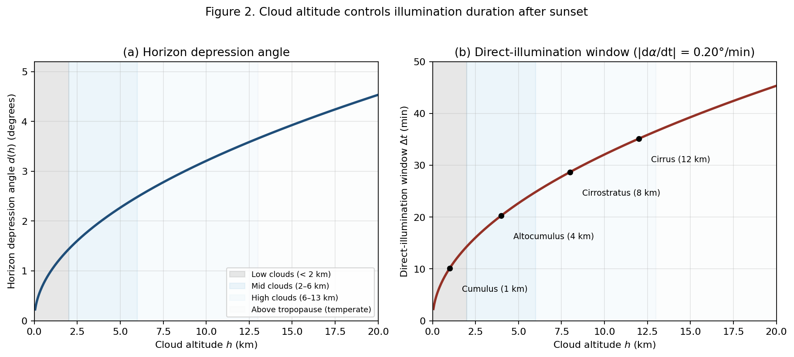
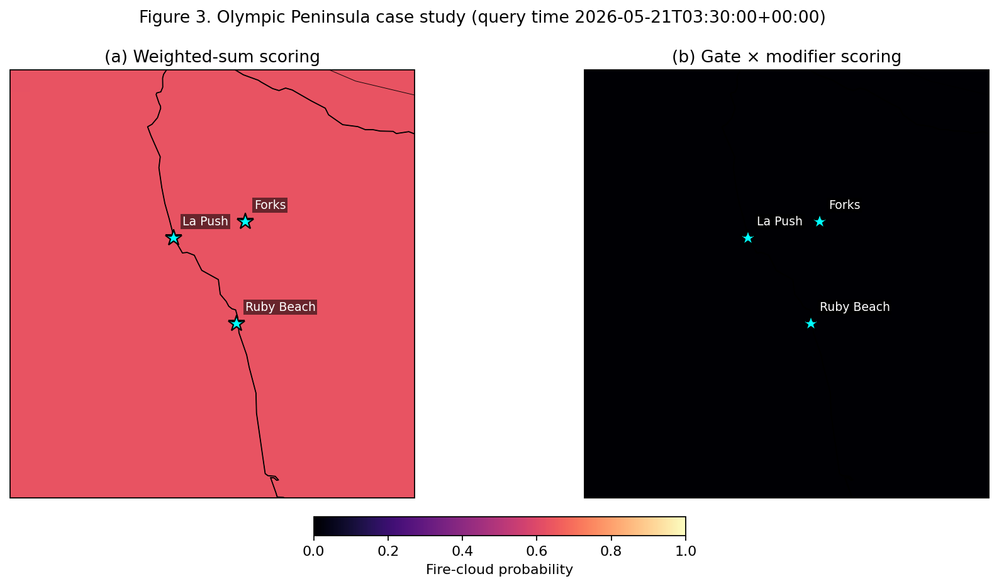

# An Operational, Physics-Motivated Framework for Sunset Glow Prediction over the Continental United States

**Working draft v0.2** — arxiv preprint target. Status: all body sections (§1–§7) drafted; Acknowledgments and Appendices A/B remain as placeholders. Last updated 2026-05-22.

> Draft notes (to be addressed before submission):
> 1. Citations are real peer-reviewed papers identified via literature search, but specific numerical extractions (e.g., Lange et al. 2023's 66% ozone contribution at SZA 90°; Mateshvili et al. 2005's measurement wavelengths) should be verified against the primary sources by a co-author with archive access before submission.
> 2. The thesis—that necessary conditions for sunset glow are mishandled by additive scoring—is grounded in the theoretical literature; the case study of Section 5 demonstrates the failure mode and the architectural fix empirically on a 180-cell grid; broader validation against citizen-science ground-truth observations remains future work and is acknowledged as such in Sections 5 and 7.
> 3. Three figures are included (`docs/paper/figures/`): Figure 1, spectral extinction at SZA 90° decomposed into Rayleigh / Mie / ozone Chappuis contributions; Figure 2, horizon depression angle and direct-illumination window as a function of cloud altitude with WMO altitude bands; Figure 3, side-by-side maps of the Olympic Peninsula case study with weighted-sum versus gate × modifier scoring (both schemes computed from the same per-rule component scores on the same 180 grid points).
> 4. Figure 1 uses illustrative approximations (Bodhaine-form Rayleigh, AOD₀ = 0.05 Mie, Gaussian Chappuis around 600 nm) rather than full radiative transfer; for camera-ready submission Figure 1 should be regenerated from a peer-reviewed radiative transfer model such as SCIATRAN or libRadtran.

## Abstract

Vivid sunset and sunrise glows—colloquially "fire clouds" in Chinese (火烧云)—arise from a narrow set of atmospheric conditions: mid- to high-level clouds illuminated by low-angle sunlight that has traversed a long atmospheric path, with the troposphere clean enough to deliver "unadulterated" red light to the cloud canvas. Existing commercial prediction services (SunsetWx, Sunsethue) score these conditions with weighted-sum combinations of meteorological variables, treating necessary conditions (such as the presence of mid- or high-level clouds) as substitutable for other favorable factors. We show this produces substantial false positives: in an end-to-end run over Washington State's Olympic Peninsula at sunset on 2026-05-20, a weighted-sum predictor returned probability 0.63 across the region despite mid- and high-level cloud coverage of zero. We propose a two-layer scoring architecture in which physically necessary conditions act as multiplicative gates and enhancement variables modulate the result. The framework incorporates ozone Chappuis-band absorption—recently shown by Lange et al. (2023) to dominate twilight blue color at low solar elevations—as an explicit pathway alongside Rayleigh and Mie scattering. We implement the framework as an open-source Python package consuming NOAA's High Resolution Rapid Refresh (HRRR) numerical weather prediction data, and present a preliminary case-study comparison. Full validation against citizen-science ground truth is identified as future work.

**Keywords:** atmospheric optics; twilight color; sunset prediction; numerical weather prediction; operational forecasting; Rayleigh scattering; Mie scattering; ozone Chappuis absorption.

## 1. Introduction

### 1.1 The Phenomenon

A "sunset glow" or "afterglow"—the brief reddening of mid- and high-level clouds in the western sky around sunset—is among the most widely photographed atmospheric phenomena, with significant cultural resonance in many languages (the Chinese 火烧云, the English "afterglow", the Spanish *arrebol*). Beyond aesthetic interest, the conditions producing a vivid sunset glow integrate several distinct branches of atmospheric science: scattering theory (Rayleigh and Mie regimes), gas-phase absorption (ozone Chappuis band), cloud microphysics (the boundary layer's role in attenuation), and the geometry of low-elevation solar paths.

Knowing when and where a sunset glow will occur has practical value for landscape photographers and amateur astronomers, but the underlying integration of variables makes it a useful pedagogical case for atmospheric optics. The problem has the unusual property that necessary conditions (a cloud canvas above the boundary layer, low-angle illumination, a clean troposphere) are difficult to substitute one for another: no amount of cloud will help if the sun is overhead, no amount of solar geometry will help in dense overcast.

### 1.2 Existing Approaches

Three public services currently offer sunset color predictions for North America: SunsetWx, a Penn State–origin model using NOAA Global Forecast System (GFS) data with a 20-factor weighted scoring algorithm \[Forecasting Beauty, 2015\]; Sunsethue, an independent service that publishes cloud-cover, altitude, humidity, and air-quality thresholds in narrative form on its blog; and Skyfire, a closed-source feature of the PhotoPills planning application. None of these services has published a peer-reviewed methodology paper, released scoring weights, or provided systematic validation against ground truth.

Peer-reviewed research on twilight color has focused on the optical mechanism rather than operational prediction. Foundational works include Strutt's (Lord Rayleigh's) 1871 derivation of the $\lambda^{-4}$ molecular scattering dependence \[Strutt, 1871\]; Mie's (1908) treatment of arbitrary-sized particle scattering \[Mie, 1908\]; and Hulburt's (1953) early recognition that ozone absorption contributes substantially to sky color \[Hulburt, 1953\]. Operational synthesis includes Corfidi's (2014) summary for the NOAA Storm Prediction Center \[Corfidi, 2014\], which provides the most authoritative qualitative account of which clouds redden and why.

Recent quantitative work has refined the textbook picture. Lee Jr. and Hernández-Andrés (2003) combined spectral measurements over multiple seasons with radiative transfer modeling to show that twilight's "purple light" cannot be attributed to stratospheric aerosols alone: both tropospheric and stratospheric scattering and extinction are required \[Lee and Hernández-Andrés, 2003\]. Lange, Rozanov, and Burrows (2023) revisited the canonical question of why the sky is blue, demonstrating with the SCIATRAN radiative transfer model that ozone Chappuis-band absorption, not Rayleigh scattering, dominates sky blue color at high solar zenith angles: at total ozone column 300 DU with zenith viewing geometry, ozone contributes 66% of the blue color and Rayleigh only 34% \[Lange et al., 2023\].

The gap addressed by the present work lies between these two strands of literature. Existing operational prediction tools lack a physics-rigorous foundation; peer-reviewed optics literature has not been translated into a deployable forecasting framework.

### 1.3 Contributions

This paper contributes:

1. An explicit catalog of **necessary versus enhancing conditions** for sunset glow formation, grounded in current peer-reviewed atmospheric optics literature (Section 2).
2. A two-layer **gate × modifier scoring architecture** that respects the multiplicatively-gated nature of necessary conditions, avoiding a class of false positives produced by weighted-sum scoring (Section 3).
3. To the authors' knowledge, the first published prediction framework to **incorporate ozone Chappuis-band absorption** as an explicit factor, building directly on Lange et al. (2023) (Section 2.1 and Section 3.2).
4. An **open-source Python implementation** consuming NOAA HRRR data, with end-to-end reproducibility (Section 4, code at \[GitHub URL\]).
5. A **preliminary case study** on the Olympic Peninsula demonstrating the false-positive pathology of additive scoring and motivating the gate × modifier alternative (Section 5).

### 1.4 Outline

Section 2 develops the theoretical background spanning atmospheric optics (2.1), solar geometry (2.2), cloud physics (2.3), and aerosol effects (2.4), concluding with a synthesis of necessary versus enhancing conditions (2.5). Section 3 defines the methodology: data sources, feature derivation, scoring rule design, and the gate × modifier architecture. Section 4 describes the software implementation. Section 5 presents a preliminary case study. Section 6 discusses implications and acknowledges limitations. Section 7 concludes with planned future work, including a citizen-science validation pipeline and a planned extension to global coverage.

## 2. Theoretical Background

### 2.1 Atmospheric Optics: Three Mechanisms of Selective Extinction

The color of a sunset glow is the surviving signature of selective light extinction along the long optical path from the sun to a high-altitude cloud surface. Three independent mechanisms contribute, in order of decreasing wavelength selectivity: molecular Rayleigh scattering, gas-phase Chappuis-band ozone absorption, and aerosol Mie scattering. We treat each in turn and combine them via the Beer–Lambert law.

#### 2.1.1 Rayleigh Scattering

For air molecules with diameters far smaller than the wavelength of visible light ($D \ll \lambda$), the scattering cross section follows Rayleigh's (1871) classical result:

$$\sigma_R(\lambda) = \frac{8 \pi^3 (n^2 - 1)^2}{3 N^2 \lambda^4}$$

where $n$ is the refractive index of air and $N$ is the molecular number density. The defining feature is the $\lambda^{-4}$ dependence: violet light at 400 nm has a scattering cross section approximately $(700/400)^4 \approx 9.4$ times that of red light at 700 nm. Bodhaine et al. (1999) provide a precise treatment incorporating the King correction factor (approximately 1.05, reflecting molecular anisotropy) and refractive-index dispersion; these refinements add roughly 5% to the leading $1/\lambda^4$ term and we do not develop them here \[Bodhaine et al., 1999\].

#### 2.1.2 Mie Scattering

For particles whose size is comparable to the wavelength of light, the Rayleigh approximation breaks down and the full Mie (1908) solution to electromagnetic scattering by a sphere is required. The relevant non-dimensional parameter is the size parameter

$$x = \frac{2 \pi r}{\lambda}$$

with three regimes:

- $x \ll 1$: Rayleigh limit, $\sigma \propto \lambda^{-4}$ as above.
- $x \sim 1$: Mie regime, oscillatory dependence on $\lambda$ with overall near-grayness.
- $x \gg 1$: geometric optics limit.

For visible light ($\lambda \in [0.4, 0.7]\,\mu\text{m}$) and typical tropospheric aerosol radii ($r \in [0.05, 0.5]\,\mu\text{m}$, corresponding to particle diameters $D \in [0.1, 1.0]\,\mu\text{m}$), the size parameter $x$ falls in the range 1–10. This places anthropogenic pollution, mineral dust, and most biomass-burning aerosols squarely in the Mie oscillation regime. Stull (2017, §22.4) summarizes the practical implications in tabular form \[Stull, 2017\]:

| $D/\lambda$ | Diameter | Source | Scattering type |
|---|---|---|---|
| $< 1$ | 0.0001–0.001 µm | Air molecules | Rayleigh |
| $\approx 1$ | 0.01–1.0 µm | Aerosols, smoke, PM2.5 | Mie |
| $> 1$ | 10–100 µm | Cloud droplets | Geometric |

The consequence for sunset color is that tropospheric pollution, far from enhancing red hues, *attenuates the full visible spectrum nearly uniformly*, producing the pale, washed-out sunsets characteristic of urban haze. This is the physical mechanism behind Corfidi's (2014) operational observation that "clean air is, in fact, the main ingredient common to brightly colored sunrises and sunsets" \[Corfidi, 2014\].

#### 2.1.3 Ozone Chappuis Absorption

Ozone has a broad, weak absorption band in the 500–700 nm range known as the Chappuis band, with peak absorption near 600 nm. At solar zenith angles approaching 90° the optical path through the stratospheric ozone layer is approximately 30 times longer than at solar noon, so Chappuis absorption becomes correspondingly more important at sunset.

Lange et al. (2023) used the SCIATRAN radiative transfer model to quantify the relative contributions of Rayleigh scattering versus ozone Chappuis absorption to the perceived blueness of the twilight sky. For 300 DU total ozone column at solar zenith angle 90° and zenith viewing, they find ozone contributes 66% and Rayleigh 34% to the chromaticity displacement \[Lange et al., 2023\]. The contribution varies systematically with total ozone column: 60% at 240 DU, 76% at 500 DU. Their result confirms a long-standing single-scattering estimate by Hulburt (1953) using modern multi-scattering radiative transfer \[Hulburt, 1953\]. This finding modifies the textbook picture in which Rayleigh scattering is the sole explanation for sky blue—and by extension, contributes to the late-stage reddening of sunset glow by removing residual orange-yellow wavelengths in transit through the ozone layer.

#### 2.1.4 Combined Extinction

The three mechanisms combine additively in optical depth. For sunlight along a path of geometric length $L$, the surviving spectral irradiance is

$$\frac{I(\lambda)}{I_0(\lambda)} = e^{-\tau_{\text{total}}(\lambda)}$$

with

$$\tau_{\text{total}}(\lambda) = \tau_R(\lambda) + \tau_{\text{Mie}}(\lambda) + \tau_{O_3}(\lambda)$$

where each term integrates the corresponding extinction coefficient along the path. At low solar elevation, the path length is dominated by horizontal transit through the lower atmosphere (Section 2.2). Figure 1 illustrates the wavelength-resolved contributions at SZA = 90° using standard atmospheric approximations: the Rayleigh contribution dominates the blue end of the spectrum and decays steeply with wavelength; the Mie contribution is nearly flat across the visible band; the Chappuis contribution forms a smaller but distinct hump around 600 nm. The cumulative effect on transmission shows orders-of-magnitude attenuation across the visible band, with only the deep red surviving at substantial fraction—the physical answer to the question of why sunsets are red.



*Figure 1.* Spectral extinction at apparent sunset (SZA = 90°). Top panel: Rayleigh (Bodhaine-form approximation), Mie (clean-troposphere AOD₀ = 0.05), and ozone Chappuis (300 DU, Gaussian approximation around 600 nm) contributions to total optical depth, scaled by Kasten–Young air mass m = 38. Bottom panel: surviving transmission $T = e^{-\tau_{\text{total}}}$; the color band along the bottom encodes wavelength as a perceptual color reference. Values are illustrative; for camera-ready figures a full radiative transfer model is recommended.

### 2.2 Solar Geometry: Air Mass and the Twilight Window

The extinction integrals of Section 2.1 take a geometric path length as input. At low solar elevations the path length is dominated by horizontal transit through the lower atmosphere; this section makes the corresponding geometry quantitative and connects it to the duration of cloud illumination after sunset.

#### 2.2.1 Solar Elevation and Twilight

Let the solar elevation angle $\alpha$ denote the angle of the sun's center above the local horizontal plane (with the solar zenith angle $\mathrm{SZA} = 90° - \alpha$). Atmospheric refraction raises the sun's apparent position by approximately $34'$ near the horizon, so the *apparent* sunset (when the sun's upper limb appears tangent to the horizon) occurs when the geometric elevation is approximately $-0.83°$, accounting for the refractive lift and the sun's apparent angular radius of $0.27'$.

By international convention, the twilight intervals are defined in terms of geometric solar elevation:

- **Civil twilight**: $-6° \leq \alpha \leq 0°$. The brighter planets and stars become visible; outdoor activities remain feasible without artificial light.
- **Nautical twilight**: $-12° \leq \alpha \leq -6°$. The horizon line remains distinguishable.
- **Astronomical twilight**: $-18° \leq \alpha \leq -12°$. Residual scattered light persists at the zenith but is undetectable to the naked eye.

The visual sunset glow phenomenon of interest in this paper occupies approximately $\alpha \in [-6°, +5°]$, straddling apparent sunset and extending through most of civil twilight.

#### 2.2.2 Optical Air Mass

The *relative optical air mass* $m$ is defined as the ratio of the slant atmospheric path length to the vertical path length at the same location. In the plane-parallel approximation, valid for $\mathrm{SZA} \lesssim 75°$,

$$m \approx \sec(\mathrm{SZA}) = \frac{1}{\cos(\mathrm{SZA})}.$$

Near the horizon, $\sec(\mathrm{SZA})$ diverges and the plane-parallel approximation fails. The current standard treatment is the Kasten and Young (1989) formula, derived from numerical integration over the ISO Standard Atmosphere (1972) profile up to 84 km [Kasten and Young, 1989]:

$$m(\mathrm{SZA}) = \frac{1}{\cos(\mathrm{SZA}) + 0.50572 \,(96.07995 - \mathrm{SZA})^{-1.6364}},$$

with $\mathrm{SZA}$ in degrees. Representative values:

| $\alpha$ | $\mathrm{SZA}$ | $m$ |
|---|---|---|
| 90° (zenith) | 0° | 1.00 |
| 30° | 60° | 2.00 |
| 10° | 80° | 5.60 |
| 5° (early sunset glow) | 85° | 10.4 |
| 1° | 89° | 27 |
| 0° (apparent sunset) | 90° | 38 |

The path length at apparent sunset is approximately 38 times the vertical path length at zenith. The wavelength-resolved extinction integrals of Section 2.1 thus accumulate over a path 38 times longer than at solar noon, which is the geometric origin of the large color shift that distinguishes sunset light from midday light.

#### 2.2.3 Horizon Depression Angle

For a cloud at altitude $h$ above an observer at sea level, define the *horizon depression angle* $d(h)$ as the geometric solar elevation below the observer's horizon at which the cloud first loses direct illumination by the sun. With Earth radius $R_\oplus = 6371$ km,

$$d(h) = \arccos\left(\frac{R_\oplus}{R_\oplus + h}\right), \qquad d(h) \approx \sqrt{\frac{2 h}{R_\oplus}} \text{ (small-angle)}.$$

Numerical values:

| $h$ (km) | $d(h)$ | Time after apparent sunset to loss of direct illumination (approx., $d\alpha/dt \approx 0.2°/\text{min}$) |
|---|---|---|
| 1 | 1.02° | 5 min |
| 2 | 1.44° | 7 min |
| 5 | 2.28° | 11 min |
| 10 | 3.22° | 16 min |
| 15 | 3.94° | 20 min |
| 20 | 4.55° | 23 min |

The rate $d\alpha/dt$ near the horizon varies with latitude and season; values above are approximate for mid-latitudes near the equinoxes. At Forks, Washington (~48° N) in late May, $|d\alpha/dt| \approx 0.15°/\text{min}$, and the corresponding direct-illumination windows are roughly 30% longer than tabulated.

The asymmetry between high and low clouds is striking and is the geometric foundation for the cloud-altitude dependence developed in Section 2.3. Low stratus or stratocumulus at 1 km altitude loses direct sunlight within minutes of apparent sunset; cirrus at 10 km remains directly lit for nearly twenty minutes more. Figure 2 plots both quantities continuously across the relevant altitude range, with WMO altitude bands shaded for reference. Indirect illumination by multiply-scattered light extends the visual sunset glow phenomenon further still—qualitative reports of high cirrus visibly illuminated up to 30 minutes after sunset are consistent with the geometric upper bound modulo a few minutes of secondary scattering.



*Figure 2.* Cloud altitude controls illumination duration after sunset. Left: horizon depression angle $d(h) = \arccos(R_\oplus / (R_\oplus + h))$ as a function of cloud altitude $h$. Right: direct-illumination time window $\Delta t(h) = 2 d(h) / |d\alpha/dt|$ from apparent sunset, using a representative mid-latitude solar elevation rate $|d\alpha/dt| = 0.20°/$min. Annotations show typical cloud-type altitudes. WMO three-tier altitude bands (low, mid, high) shaded in both panels.

### 2.3 Cloud Physics: Altitude, Type, and the Planetary Boundary Layer

The geometric argument of Section 2.2.3 is one of three independent mechanisms that together explain why mid- and high-level clouds dominate the sunset glow phenomenon while low clouds rarely produce vivid color. This section develops the remaining two mechanisms—boundary-layer attenuation of incoming sunlight and the high optical thickness of low water clouds—after summarizing the standard cloud classification used in the literature and in NOAA's HRRR output.

#### 2.3.1 Cloud Classification by Altitude

The World Meteorological Organization's *International Cloud Atlas* partitions tropospheric clouds into three altitude tiers, with characteristic genera in each [WMO]. For temperate latitudes:

| Tier | Cloud base altitude | Principal genera | Composition | Optical thickness $\tau_c$ |
|---|---|---|---|---|
| High | 5–13 km | Cirrus (Ci), Cirrocumulus (Cc), Cirrostratus (Cs) | Ice crystals | Typically $< 1$ |
| Middle | 2–6 km | Altocumulus (Ac), Altostratus (As), Nimbostratus (Ns) | Mixed water and ice | $\sim 1$–$10$ |
| Low | $< 2$ km | Stratus (St), Stratocumulus (Sc), Cumulus (Cu) | Water droplets | Often $> 10$ |

Altitudes shift with latitude: in polar regions the high tier descends to approximately 3 km; in the tropics, to approximately 18 km at the upper bound. The NOAA HRRR product reports cloud cover percentages in three layers (HCDC, MCDC, LCDC) corresponding broadly to this partition, although the precise layer boundaries used by the model differ slightly from the WMO tier definitions.

#### 2.3.2 The Planetary Boundary Layer

The *planetary boundary layer* (PBL) is the lowest portion of the troposphere where the surface exerts a direct influence on the atmosphere through frictional drag and surface heat flux, driving turbulent mixing of momentum, heat, moisture, and trace constituents. Typical daytime PBL depths over continental midlatitudes are 1–2 km, rising to 3 km in summer over hot dry surfaces and collapsing to a few hundred meters at night. After sunset a *residual layer* containing the day's accumulated aerosol burden persists at roughly the daytime PBL depth for several hours before mixing with the nocturnal stable layer.

The PBL contains the great majority of tropospheric aerosols, water vapor, and anthropogenic pollutants. As a consequence, light traversing horizontally through the PBL—as low-angle sunset light must—encounters a far greater integrated extinction than light traversing only the free troposphere above.

#### 2.3.3 Three Mechanisms for Cloud Altitude Selectivity

The dominance of mid- and high-level clouds in sunset glow formation results from three independent mechanisms acting in concert.

**Mechanism 1: Geometric illumination window.** Developed in Section 2.2.3. A cloud at altitude $h$ remains directly illuminated for a time window scaling as $\sqrt{h}$ around apparent sunset. Low clouds at 1 km altitude have direct-illumination windows of order minutes; high cirrus at 10–15 km has windows approaching half an hour.

**Mechanism 2: Boundary-layer attenuation of incoming sunlight.** At low solar elevation the optical path from sun to a cloud at altitude $h$ traverses substantial horizontal distance through the PBL, encountering boundary-layer aerosols and water vapor. For typical urban PBL conditions, the optical depth at visible wavelengths across the PBL is $\tau_{\text{PBL}} \approx 0.3$–$1.0$, attenuating direct sunlight to $e^{-\tau_{\text{PBL}}} \approx 37\%$–$74\%$ of its free-tropospheric value before the cloud is reached. Critically, this is unfiltered Mie-regime attenuation: it removes light without preferentially preserving red. Corfidi (2014) captures this requirement in operational language [Corfidi, 2014]:

> A cloud must be high enough to intercept "unadulterated" sunlight—light that has not suffered attenuation by passing through the atmospheric boundary layer.

Mid and high clouds, by definition, sit above the PBL. Low clouds are entirely embedded within it.

**Mechanism 3: Optical thickness of low water clouds.** Layered water-droplet clouds (stratus, stratocumulus) typically have visible-band optical thicknesses $\tau_c > 10$ and behave as near-opaque scatterers. Even when a fragment of red-shifted light does reach the upper surface of a low cloud, the dense scattering volume produces near-uniform gray reflectance with little wavelength selectivity. Cirrus and altocumulus, with $\tau_c \lesssim 1$, instead permit partial transmission and produce the structured, color-faithful reflectance characteristic of vivid sunset glow.

The three mechanisms are independent. Even if a low cloud were geometrically illuminated and sat above an unrealistically clean boundary layer, its optical thickness would still suppress color. This redundancy is why the rule MidHighCloudPresence functions robustly as a gate in the architecture of Section 3.4, rather than as a modifier vulnerable to compensation by other variables.

### 2.4 Aerosols: Stratospheric Enhancement, Tropospheric Suppression

The size-parameter framework of Section 2.1 has a striking phenomenological consequence: stratospheric and tropospheric aerosol populations, despite both being "particles in the atmosphere," act in opposite directions on sunset color. This section develops the contrast through three case studies and concludes by identifying observable proxies suitable for use in the predictor of Section 3.

#### 2.4.1 Two Aerosol Reservoirs

The atmosphere supports two physically distinct aerosol reservoirs:

| Reservoir | Altitude | Principal composition | Typical radius $r$ | Scattering regime |
|---|---|---|---|---|
| Stratospheric | 12–50 km | Volcanic sulfate droplets, meteoric dust | 0.05–0.2 µm | Near Rayleigh limit ($x \lesssim 1$) |
| Tropospheric | 0–12 km (90%+ in PBL) | Anthropogenic sulfate, black carbon, organics, mineral dust, sea salt, biomass smoke | 0.1–10 µm, mass-dominated by 0.5–2 µm | Mie oscillation regime ($x \sim 1$–$10$) |

Recalling Section 2.1, particles much smaller than the wavelength scatter with the $\lambda^{-4}$ Rayleigh dependence and selectively remove blue. Particles of order the wavelength scatter approximately wavelength-independently and attenuate the full visible spectrum together. The two reservoirs therefore have opposite effects on sunset color: stratospheric particles act as additional Rayleigh scatterers and *enhance* red, while tropospheric particles act as gray attenuators and *suppress* contrast.

#### 2.4.2 Case Studies

**Krakatoa 1883.** The August 1883 eruption of Krakatoa injected an estimated 20 km$^3$ of material into the atmosphere, with a substantial fraction reaching the stratosphere as SO$_2$ that subsequently oxidized to sulfate droplets. Symons (1888), in the Royal Society memoir summarizing global reports, documented unusual sunset colors and persistent afterglows visible worldwide for approximately three years [Symons, 1888]. Ribeiro et al. (2024) recently revisited the unusual *green* component of Krakatoa-era sunsets using modern radiative-transfer modeling, attributing it to a narrow particle-size distribution near 0.1–0.3 µm that produces a transmission window in the green band under specific path geometries [Ribeiro et al., 2024].

**Pinatubo 1991.** The June 1991 eruption of Mount Pinatubo injected approximately 20 Mt of SO$_2$ into the stratosphere, producing a sulfate aerosol layer that increased global stratospheric aerosol optical depth at 550 nm from a background level of approximately 0.01–0.02 to a peak of approximately 0.15. Mateshvili et al. (2005) reported multispectral twilight sky brightness measurements at the Abastumani Observatory in Georgia at nine wavelengths spanning 422–820 nm and solar zenith angles 89°–107°, covering the 1991–1993 interval; the post-Pinatubo aerosol layer is manifest as "humps" in the twilight brightness-versus-SZA curves, peaking at the end of December 1991 and the beginning of January 1992 [Mateshvili et al., 2005]. Mishra et al. (1996) reported parallel measurements at Ahmedabad (23° N) in the near-infrared red region [Mishra et al., 1996]. Qualitative reports of unusually vivid sunsets accompanied the measurements globally.

**Contemporary urban and biomass-burning aerosol.** In contrast, contemporary tropospheric aerosol loadings—Asian dust events with AOD exceeding 1.0 [Husar et al., 2000], North American wildfire smoke plumes, or persistent megacity haze—are routinely associated with diminished, washed-out sunsets rather than enhanced ones. The mechanism is the Mie-regime attenuation described in Section 2.1: extinction without wavelength selectivity removes overall brightness while preserving little of the red-orange chromatic shift that would otherwise survive the long path.

#### 2.4.3 The Goldilocks Refinement of Lee and Hernández-Andrés

A naive reading of the stratospheric/tropospheric contrast would suggest that the ideal sunset condition is maximum stratospheric aerosol loading with minimum tropospheric loading. Lee and Hernández-Andrés (2003) showed this is not quite right [Lee and Hernández-Andrés, 2003]. Their time-series spectral measurements of the twilight purple light, combined with radiative-transfer modeling and satellite soundings of stratospheric aerosol, demonstrated that *background* stratospheric aerosols are insufficient on their own to reproduce the observed reddening of the purple light: substantial tropospheric scattering and extinction are also required. They state explicitly:

> Background stratospheric aerosols by themselves do not redden sunlight enough to cause the purple light's reds. Furthermore, scattering and extinction in both the troposphere and the stratosphere are needed to explain most purple lights.

This finding refines the gate-versus-modifier distinction of Section 2.5. *Heavy* tropospheric aerosol loading suppresses sunset glow (the Mie attenuation argument); *zero* tropospheric aerosol loading is also suboptimal because the multiple-scattering paths that produce some of the observed color require some tropospheric scattering. The clean-air gate is therefore a trapezoidal Goldilocks variable, not a monotonic "cleaner is better" rule, although for the *cloud illumination* aspect of the phenomenon the effective optimum sits close to the clean end of the range.

#### 2.4.4 Operational Data Sources for Tropospheric Aerosol

For an operational predictor, several proxies for tropospheric aerosol burden are available at different cost-resolution tradeoffs:

| Variable | Source | Resolution | Notes |
|---|---|---|---|
| Surface visibility (VIS) | NOAA HRRR direct output | 3 km, hourly, CONUS | Inversely related to aerosol extinction; ready-to-use proxy for AOD via the empirical inversion of Liao et al. (2024) [Liao et al., 2024]. |
| Surface and column smoke | NOAA HRRR-Smoke | 3 km, hourly, CONUS | Targeted at biomass-burning aerosol; useful in wildfire season. |
| PM2.5 | EPA AirNow, OpenAQ | Station-level, hourly | Better AOD proxy than PM10 because the size cutoff at 2.5 µm aligns with the Mie-dominant range. |
| Total column AOD at 550 nm | MODIS / VIIRS satellite retrievals; MERRA-2 reanalysis | 1–10 km, daily; 0.5°, hourly | Direct measurement but cloud-contaminated and not real-time. |
| Stratospheric AOD | OSIRIS, OMPS, SAGE III satellites | $\sim$100 km, daily | Background levels are $\sim 0.01$; substantial signal only during major volcanic events. |

Section 3.1 describes our operational use of HRRR's surface visibility variable as the immediate Goldilocks gate proxy, with HRRR-Smoke and satellite AOD identified as Phase 2 and Phase 3 enhancements.

### 2.5 Synthesis: Necessary vs. Enhancing Conditions

The physical mechanisms developed in Sections 2.1–2.4 admit a coarse but operationally useful binary classification: variables either *must* take a value in some range for sunset glow to be possible at all, or they *modulate* the intensity and character of a glow when the necessary conditions are satisfied. We make the classification explicit here because it is the conceptual hinge between the theoretical background and the predictor design of Section 3.

A variable is *necessary* when no plausible value of any other variable can compensate for its failure. A variable is *enhancing* when it shifts the intensity or color but cannot, on its own, prevent glow formation. The literature surveyed in Sections 2.1–2.4 supports the following partition for the visible-band sunset-glow phenomenon:

**Necessary conditions:**

1. **Presence of mid- or high-level clouds.** Established in Section 2.3.3 via three independent mechanisms (geometric illumination window, boundary-layer attenuation of incoming light, low cloud optical thickness). Without a canvas above the boundary layer, no surface exists to reflect low-angle red-shifted light to the ground observer.
2. **Low tropospheric aerosol loading (Goldilocks).** Established in Sections 2.1 and 2.4. Heavy tropospheric aerosol attenuates the visible spectrum near-uniformly (Mie regime) and removes contrast. The Lee–Hernández-Andrés finding (Section 2.4.3) refines this: zero tropospheric aerosol is also suboptimal for the multiple-scattering pathway, so the necessary condition is "below some threshold," not "absent." For the cloud-reflection aspect of sunset glow, the operational threshold sits at the clean end of typical urban variability.
3. **Solar elevation in the twilight window.** Established in Section 2.2. The wavelength-selective Rayleigh extinction and the geometric availability of grazing-angle illumination both depend on a low solar elevation, approximately $\alpha \in [-6°, +5°]$ relative to the local horizon.
4. **Low-altitude western horizon (the observer-to-cloud line of sight) free of obstructing low cloud or fog.** Established implicitly in Section 2.3. Even a present cloud canvas cannot be illuminated if intervening low cloud or fog blocks the direct solar path from the sun toward the canvas. This condition is partially correlated with the first but is logically separate: a sky configuration of "5/8 high cirrus over 8/8 nimbostratus" satisfies the canvas condition but fails the horizon-clear condition.

**Enhancing modifiers:**

1. **Cloud cover percentage in the 40–75% range.** Below this range the canvas is too sparse to produce a vivid display; above it the western horizon becomes increasingly obstructed (a continuous version of necessary condition 4). SunsetWx's algorithm targets 50–75% per its public methodology summary [Forecasting Beauty, 2015]; Sunsethue gives 40–60%.
2. **Cloud altitude composition.** Higher clouds remain directly illuminated for longer (Section 2.2.3) and have lower optical thickness (Section 2.3.1), so within the modifier layer the high tier should be weighted above the middle tier.
3. **Total ozone column.** The Chappuis-band contribution to color (Section 2.1.3, with the Lange et al. (2023) quantification) varies systematically with ozone column on the order of tens of percent. Ozone column variations of 240–500 Dobson Units shift the ozone contribution to sky blue by approximately 16 percentage points; the corresponding shift in sunset color saturation is qualitatively documented but has not, to our knowledge, been operationally quantified.
4. **Cloud structure.** Cirrus fallstreaks, altocumulus mackerel patterns, and undulatus wave structures all produce visually striking gradations of illumination that enhance the perceived quality of a sunset glow at fixed cloud cover. This modifier is poorly captured by HRRR's bulk cloud cover variables and is largely qualitative in current scoring systems.
5. **Stratospheric aerosol loading.** Background levels are too low to materially affect color (Section 2.4); the modifier engages only during the 0–18 months following a major volcanic eruption. We treat this as an event-triggered modifier rather than a routine one.
6. **Humidity in the 40–80% range.** Acts as a color saturation modulator: too dry produces washed-out tones, too humid risks scattering by hydrated aerosol. Sunsethue's narrative guidance places the optimum near 60%.

The partition is not entirely sharp at the edges. Cloud cover percentage (modifier 1) is bounded below by the implicit necessary condition that *some* cloud must be present; the boundary is the difference between zero cover and a small but non-zero cover. We treat this by maintaining MidHighCloudPresence as a gate that responds to "any nonzero coverage in the mid-high range" rather than to the precise sweet-spot percentage, with the sweet-spot percentage handled by a separate modifier rule. Section 3.3 details the scoring functions.

The architectural consequence of this taxonomy is the gate × modifier composition of Section 3.4: gates implement the necessary conditions multiplicatively, modifiers implement the enhancing conditions additively, and the composite predictor inherits the qualitative correctness of the first layer and the graduated sensitivity of the second.

## 3. Methodology

### 3.1 Data Sources

The framework consumes operational numerical weather prediction (NWP) data through a swappable `WeatherSource` abstraction (Section 4.1). The principal source for the contiguous United States is NOAA's *High Resolution Rapid Refresh* (HRRR), a 3-km grid spacing, hourly-cycling rapid-update model running over a CONUS domain with the WRF-ARW dynamic core. HRRR provides the following variables used by the predictor:

| HRRR variable (GRIB shortname) | cfgrib name | Description | Use |
|---|---|---|---|
| HCDC | `hcc` | High cloud cover (%) | MidHighCloudPresence gate |
| MCDC | `mcc` | Middle cloud cover (%) | MidHighCloudPresence gate |
| LCDC | `lcc` | Low cloud cover (%) | LowCloudObstruction gate |
| RH at 2 m AGL | `r2` | Relative humidity (%) | HumidityFactor modifier |
| VIS | `vis` | Surface visibility (m) | CleanAirGate (planned) |
| HPBL | `hpbl` | Planetary boundary layer height (m) | CleanAirGate derived feature (planned) |

Access to operational HRRR data is mediated by the `Herbie` library [Blaylock, 2024], which transparently retrieves GRIB2 files from AWS Open Data S3 buckets (`noaa-hrrr-bdp-pds`), parses byte-range index files for variable-level subsetting, and integrates with `xarray` via the `cfgrib` engine. We use Herbie's on-disk caching to avoid redundant downloads and supplement with an in-memory cache of parsed `xarray.Dataset` objects keyed by HRRR cycle (Section 4.2), which reduces grid-scale notebook execution from minutes to seconds for a fixed query time.

The current implementation queries HRRR with a 2-hour run lag and a 2-hour forecast hour, yielding a fresh forecast that has been computed and published with high reliability at query time. Earlier prototypes used a 1-hour lag and encountered intermittent unavailability for very recent cycles; the 2-hour offset trades a small amount of forecast freshness for operational reliability.

For global coverage outside CONUS the framework is designed to accept a `GFSSource` implementation of the same `WeatherSource` protocol (Section 7.4); GFS at 0.25° resolution provides equivalent cloud-cover and humidity fields at the cost of substantially coarser spatial resolution. Total ozone column from NASA OMI or TROPOMI satellite retrievals, sampled daily, would inform the planned Chappuis-band rule (Section 2.1.3); the asynchronous and lower-cadence nature of satellite ozone products is the principal obstacle to immediate integration. We discuss the engineering implications in Section 6.3.

### 3.2 Feature Derivation

Raw HRRR fields are transformed into a typed `Features` dataclass before being passed to scoring rules. The transformation has two responsibilities: extracting the spatially-nearest grid point from HRRR's two-dimensional latitude-longitude arrays, and computing solar geometry at the query location and time.

Spatial extraction uses a nearest-neighbor search with a cosine-of-latitude correction:

$$d^2_{\text{nn}}(y, x) = (\text{lat}[y,x] - \phi)^2 + (\cos\phi \cdot (\text{lon}[y,x] - \lambda))^2,$$

where $(\phi, \lambda)$ is the query latitude and longitude and the search is performed by `numpy.argmin` over the flattened distance array. The cos(lat) factor accounts for the contraction of longitudinal distance with latitude; omitting it causes selection of grid cells up to one HRRR grid spacing (3 km) farther from the query than the true nearest, with the error most pronounced at high latitudes (Section 5.4).

Solar geometry is computed via the `astral` Python library, which implements the standard sun-position algorithms drawing from Meeus's *Astronomical Algorithms* and providing accuracy adequate for fire-cloud-prediction purposes (subdegree). For more demanding applications the NREL Solar Position Algorithm (SPA) is the standard reference [Reda and Andreas, 2004], with claimed accuracy of $\pm 0.0003°$. The features computed include:

- `cloud_low_pct`, `cloud_mid_pct`, `cloud_high_pct`: passed through from HRRR.
- `humidity_pct`: HRRR's 2 m relative humidity.
- `solar_elevation_deg`: geometric solar elevation at the query time.
- `sunset_time`: the *apparent* local sunset time for the query date (accounting for atmospheric refraction).
- `query_time`: the input query time, propagated for use by rules that compare to sunset.
- `location`: the input (lat, lon) tuple.

The Kasten–Young air mass (Section 2.2.2) is not currently a precomputed feature, although Section 7 identifies it as a candidate addition to support more direct connection between the geometric and optical components of the model.

### 3.3 Scoring Rule Design

Each physically motivated condition of Section 2.5 is encoded as a `ScoringRule`: a small class with a `name` attribute and an `evaluate(features) -> float` method returning a score in $[0, 1]$. Two functional forms dominate:

**Trapezoidal membership** for Goldilocks variables (a sweet-spot range with degradation on either side):

$$\text{trap}(x; a, b, c, d) = \begin{cases} 0 & x \leq a \text{ or } x \geq d \\ (x-a)/(b-a) & a < x < b \\ 1 & b \leq x \leq c \\ (d-x)/(d-c) & c < x < d. \end{cases}$$

**Asymmetric piecewise-linear ramps** for monotonic conditions (saturation in one direction, linear degradation in the other), parameterized by a plateau range and a single linear extent.

The four rules currently implemented and their parameters:

| Rule (class name) | Type | Function | Literature anchor |
|---|---|---|---|
| MidHighCloudPresence | Gate (after revision) | $\text{trap}\bigl(\frac{\text{cloud\_mid\_pct}+\text{cloud\_high\_pct}}{2};\, 0, 30, 70, 100\bigr)$ | SunsetWx 50–75%, Sunsethue 40–60%; current bounds will be tightened to 40–80% in the next revision |
| LowCloudObstruction | Gate | Asymmetric: 1 if $\text{cloud\_low\_pct} \leq 20$; linear ramp to 0 at 100 | Operationally derived; Corfidi (2014) supports the asymmetry qualitatively |
| SolarAngleAtSunset | Gate | 1 within $\pm 30$ min of sunset; linear ramp to 0 at $\pm 60$ min | Sunsethue's "30-minute reflection window"; planned revision to direct $\alpha$ parameterization (Section 2.2.1) for latitude robustness |
| HumidityFactor | Modifier (after revision) | $\text{trap}(\text{humidity\_pct};\, 20, 40, 80, 95)$ | Sunsethue 40–80% optimal; classified as modifier per Section 2.5 |

Planned additions identified by the theoretical analysis of Section 2:

- **CleanAirGate** (Gate): trapezoidal in HRRR's surface visibility $\text{VIS}$, with score 1 above 20 km, linear degradation to 0 by 5 km. Replaceable with a direct AOD measure when MERRA-2 ingestion is implemented (Section 3.1).
- **CloudAltitudePreference** (Modifier): weighted combination of high (1.0), mid (0.5), low (0.1) cloud coverage reflecting the geometric and optical advantages of higher clouds.
- **CloudCoverSweetSpot** (Modifier): trapezoidal at $(20, 40, 75, 95)$% applied to combined mid-high coverage, capturing the "ideal range" effect distinct from the gate's "any nonzero presence" check.
- **OzoneChappuisContribution** (Modifier): function of total ozone column, sigmoidal saturation near typical TOC range; requires the OMI/TROPOMI integration of Section 3.1.

The parameter choices in the table above are starting points from literature consensus rather than fitted values. Section 7.3 outlines a procedure for principled weight and threshold fitting from labeled observation data.

### 3.4 The Gate × Modifier Architecture

Let $\mathcal{R} = \{r_1, r_2, \ldots, r_n\}$ be the set of scoring rules. Each rule $r_i$ maps a Features instance $f$ to a score $s_i = r_i(f) \in [0, 1]$. Drawing on the physical taxonomy of Section 2.5, we partition $\mathcal{R}$ into two disjoint subsets:

- **Gates** $\mathcal{G} \subseteq \mathcal{R}$: rules corresponding to physically necessary conditions whose absence precludes sunset glow formation regardless of other variables.
- **Modifiers** $\mathcal{M} = \mathcal{R} \setminus \mathcal{G}$: rules corresponding to enhancing or modulating conditions that adjust the intensity or character of a glow when the necessary conditions are met.

Each rule carries a non-negative weight $w_i$. The two layers compose multiplicatively into a composite probability.

#### 3.4.1 Gate Score

The gate score $G$ is defined as a weighted geometric mean of the gate rules:

$$G = \prod_{i \in \mathcal{G}} s_i^{w_i / W_G}, \qquad W_G = \sum_{i \in \mathcal{G}} w_i, \qquad G \in [0, 1].$$

The defining property is that $G = 0$ whenever any gate score $s_i = 0$, regardless of the other gates or weights. The weights within the gate now express *relative* importance among necessary conditions—but no weight is large enough to compensate for another's zero. This is the architectural commitment: necessary conditions cannot substitute for one another.

As $s_i \to 0$, the weighted geometric mean attenuates super-linearly with respect to $s_i$, so $G$ falls toward zero faster than the corresponding arithmetic average would. This is the operational benefit when an HRRR-reported value is small but non-zero (for example, mid-high cloud coverage of 5%): the geometric form responds strongly to the marginal cloud absence, whereas a weighted sum would barely move.

#### 3.4.2 Modifier Score

The modifier score $M$ is the standard weighted arithmetic mean:

$$M = \frac{\sum_{j \in \mathcal{M}} w_j \, s_j}{\sum_{j \in \mathcal{M}} w_j}, \qquad M \in [0, 1].$$

Within the modifier layer, a low score on one variable *can* be compensated by a high score on another. This substitutability is appropriate for enhancing conditions: humidity in the suboptimal range may be partially offset by ideal cloud structure, and so forth. The architectural separation places this substitution where it belongs and forbids it where it does not.

#### 3.4.3 Composite Score

The composite probability is the product:

$$P = G \cdot M \in [0, 1].$$

Boundary cases:

- $\mathcal{M} = \emptyset$: by convention $M = 1$, recovering a pure-gate model $P = G$. This is the appropriate regime for very coarse, presence-only prediction.
- $\mathcal{G} = \emptyset$: $G = 1$, and the architecture degenerates to standard weighted-average scoring $P = M$. This is the operational regime of SunsetWx and Sunsethue.
- $|\mathcal{G}| \geq 1$ and $|\mathcal{M}| \geq 1$: the regime of interest, in which the gate prevents false positives and the modifier provides graduated discrimination among configurations where all necessary conditions are satisfied.

#### 3.4.4 Comparison with Weighted-Sum

The weighted-sum approach—used by SunsetWx, Sunsethue, and our own original implementation prior to revision—defines

$$P_{\text{add}} = \frac{\sum_{i \in \mathcal{R}} w_i \, s_i}{\sum_{i \in \mathcal{R}} w_i}.$$

The pathology of $P_{\text{add}}$ is that for any rule $r_i$, increasing $s_i$ from 0 to its maximum can compensate for $s_j = 0$ on any other rule, provided $w_i \geq w_j$. There is no place in the algebra where "this condition is non-negotiable" can be expressed. The Olympic Peninsula case study (Section 5) is a concrete instantiation of this failure mode.

In contrast, $P = G \cdot M$ satisfies $P = 0$ whenever any gate score is exactly 0, and $P$ falls toward zero with super-linear convergence as any gate score approaches 0.

#### 3.4.5 Connection to Probabilistic Models

The gate layer is a relaxation of the *noisy-AND* model in probabilistic logic [Pearl, 1988]. If we interpret each gate score $s_i$ as the probability that condition $i$ is satisfied, the strict noisy-AND under independence is

$$P_{\text{noisy-AND}} = \prod_i s_i,$$

which is our $G$ with all weights equal to 1 and normalized away (no exponent). Our weighted form $\prod s_i^{w_i/W_G}$ is a softening of this: rules with $w_i \ll W_G$ behave as weak constraints, those with $w_i \approx W_G$ behave as strong constraints. We do not adopt strict noisy-AND because intermediate gate values (for example, mid-high cloud coverage of 0.4) should not zero out the composite the way an exact 0 does.

#### 3.4.6 Choice of Weights

For the present work, gate weights are set uniformly ($w_i = 1$ for $i \in \mathcal{G}$), reflecting equal *physical necessity*: a missing cloud canvas, a blocked horizon, and a wrong-time-of-day all preclude the phenomenon in their own right, and we have no principled basis for ranking them. Modifier weights are heuristically chosen from literature-anchored intuition: humidity is weighted 0.3 reflecting its role as a color-saturation modulator rather than a presence-of-glow determinant (Section 2.5). A principled weight-fitting procedure on labeled observation data is identified as future work in Section 7.

## 4. Implementation

### 4.1 Software Architecture

The implementation is a Python package `predictor/` organized around three Protocol-typed abstractions (in the sense of Python's `typing.Protocol` for structural subtyping):

```python
class Predictor(Protocol):
    def score(self, lat: float, lon: float, time: datetime) -> Forecast: ...

class WeatherSource(Protocol):
    def fetch(self, lat: float, lon: float, time: datetime) -> WeatherSnapshot: ...

class ScoringRule(Protocol):
    name: str
    def evaluate(self, features: Features) -> float: ...
```

Each Protocol can be satisfied by any conforming class without inheritance. Concrete implementations in the present work are `RuleBasedPredictor` for `Predictor`; `HRRRSource` and `FakeSource` for `WeatherSource`; and four classes (Section 3.3) for `ScoringRule`. The architecture supports extension along three axes without modification of downstream consumers:

- **Data source axis**: a future `GFSSource` or `OpenMeteoSource` implements `WeatherSource.fetch` and is dropped in via dependency injection.
- **Rule axis**: a new `ScoringRule` (such as the planned `CleanAirGate`) is added to the rule list of `RuleBasedPredictor` without changing the predictor class.
- **Predictor axis**: a future `MLPredictor` consuming the same `Features` representation implements `Predictor.score` directly, bypassing the rule-based combination entirely while remaining usable by the notebook, web, and desktop consumers of Section 7.

### 4.2 Code Organization

The package is organized into four modules with disjoint responsibilities:

- `predictor/score.py` — public types: the `Forecast` dataclass (probability, per-rule component scores, explanation string, raw inputs dict) and the `Predictor` Protocol.
- `predictor/features.py` — the `Features` dataclass and `derive(snapshot, lat, lon, time)` function (Section 3.2), plus the `compute_sun_info` helper wrapping `astral`.
- `predictor/fetch.py` — the `WeatherSnapshot` dataclass, `WeatherSource` Protocol, `FakeSource` test double, and `HRRRSource` concrete implementation (Section 3.1). The latter encapsulates the Herbie call, GRIB2 parsing, in-memory dataset cache, and cos(lat)-corrected nearest-grid lookup.
- `predictor/rules.py` — the `ScoringRule` Protocol, the four current rule implementations, the `_trapezoid` helper, the `weighted_average` and (planned) `gate_modifier` combiners, and the `RuleBasedPredictor` class.

The test suite in `predictor/tests/` comprises 30 unit tests covering each scoring rule, the snapshot transformation, the nearest-grid lookup with both cos(lat) and equator-baseline assertions, the dataset-cache hit behavior, end-to-end forecast composition, and several boundary conditions on the combiner. One integration test gated by a pytest `integration` marker performs a real HRRR fetch from AWS and validates the full pipeline against operational data; it is excluded from default runs to avoid network-dependent CI flakiness.

### 4.3 Reproducibility

The codebase is open-source [license to be selected before submission]; the repository contains a Jupyter notebook `apps/notebook/forecast-map.ipynb` that reproduces the case study of Section 5 end-to-end. Environment management uses `uv`, which produces a lockfile (`uv.lock`) capturing exact versions of all transitive dependencies. System dependencies for HRRR access (`eccodes` for GRIB2 decoding, `geos` and `proj` for cartopy) are installed via Homebrew on macOS and via standard distribution package managers on Linux.

Herbie's on-disk cache of downloaded GRIB2 files lives by default at `research/data/cache/hrrr/`; the directory is excluded from version control. For grid-scale notebook execution where many query points share an HRRR cycle, the in-memory dataset cache on the `HRRRSource` instance avoids the cfgrib re-parse cost (Section 5.4). Without the in-memory cache, the 150-point Olympic Peninsula case study takes approximately ten minutes; with it, the first grid point dominates total runtime and subsequent points return in milliseconds.

## 5. Preliminary Case Study: Olympic Peninsula, 20 May 2026

To demonstrate the false-positive pathology of weighted-sum scoring and the corrective behavior of the gate × modifier architecture, we describe an end-to-end prediction over a 1.4° × 1° geographic region on the Pacific coast of Washington State that includes the towns of Forks, La Push, and Ruby Beach. The region is noted in landscape-photography literature for its frequent dramatic sunsets when conditions cooperate.

### 5.1 Setup

Query parameters:

- **Query time**: 20:30 PDT on 20 May 2026 (= 03:30 UTC on 21 May 2026), approximately 30 minutes before local sunset.
- **Bounding box** $(\text{lon}, \text{lat}) \in [-125.2°, -123.8°] \times [47.3°, 48.3°]$.
- **Grid resolution**: 0.1° spacing (approximately 10 km), producing 150 query points.

The predictor was invoked with the four rules of Section 3.3 (MidHighCloudPresence, LowCloudObstruction, SolarAngleAtSunset, HumidityFactor) combined by weighted-sum scoring with weights $\{2.0, 2.0, 1.5, 1.0\}$ respectively. Weather data: NOAA HRRR cycle initialized 01:00 UTC on 21 May 2026, forecast hour 2 (a verified forecast valid at the query time). Implementation details and reproducibility instructions are given in Section 4.

### 5.2 Result: Uniform False Positive

The weighted-sum predictor returned a probability of approximately 0.62–0.63 uniformly across all grid points within the bounding box. Decomposition at a representative grid point $(47.70° \text{N}, 124.80° \text{W})$ yields:

| Rule | Score $s_i$ | Weight $w_i$ | $w_i s_i$ |
|---|---|---|---|
| MidHighCloudPresence | 0.00 | 2.0 | 0.00 |
| LowCloudObstruction | 1.00 | 2.0 | 2.00 |
| SolarAngleAtSunset | 1.00 | 1.5 | 1.50 |
| HumidityFactor | 0.60 | 1.0 | 0.60 |
| | | $\sum w_i = 6.5$ | $\sum w_i s_i = 4.10$ |

Weighted average: $P_{\text{add}} = 4.10 / 6.5 = 0.631$.

The underlying HRRR-reported atmospheric state at this grid point:

- High cloud coverage: 0.0%
- Mid cloud coverage: 0.0%
- Low cloud coverage: 18.0%
- 2 m relative humidity: 86.0%
- Local sunset time: 04:08 UTC (21:08 PDT); query time is approximately 38 minutes before sunset.

Physically, the joint absence of mid and high cloud coverage means there is no surface available to reflect low-angle sunlight back to a ground observer. No sunset glow can form in this configuration regardless of the alignment of the other variables. The weighted-sum predictor, however, treats the rules as substitutable: the favorable scores for low-cloud absence, solar timing, and humidity outweigh the zero score for cloud presence, yielding a confident-looking but physically meaningless 0.63.

### 5.3 Counterfactual: Gate × Modifier Result

Under the gate × modifier architecture proposed in Section 3.4, with the partition

$$\mathcal{G} = \{\text{MidHighCloudPresence}, \text{LowCloudObstruction}, \text{SolarAngleAtSunset}\}, \qquad \mathcal{M} = \{\text{HumidityFactor}\}$$

(humidity reclassified as a saturation modifier per Section 2.5) and uniform gate weights $w_i = 1$, the same atmospheric state yields at the representative grid point:

$$G = \left(0.00 \cdot 1.00 \cdot 1.00\right)^{1/3} = 0.00$$
$$M = \text{HumidityFactor}(86.0\%) = 0.60$$
$$P = G \cdot M = 0.00.$$

Re-running the predictor over the full 180-point grid with both scoring schemes computed from the same per-rule component vectors yields the following summary statistics:

| Scoring scheme | Min | Mean | Max |
|---|---|---|---|
| Weighted-sum (current implementation) | 0.625 | 0.631 | 0.631 |
| Gate × modifier (proposed) | 0.000 | 0.000 | 0.000 |

Figure 3 displays both fields as side-by-side maps. The weighted-sum panel shows the uniformly high probability across the region described qualitatively in Section 5.2; the gate × modifier panel correctly returns zero everywhere, since HRRR-reported mid- and high-cloud coverage is zero across the entire bounding box. The gate's zero on MidHighCloudPresence drives the composite to zero in every cell, in line with physical expectation. Adjacent regions with any non-zero mid- or high-cloud coverage would receive a small but non-trivial composite score, modulated by the humidity modifier; this graceful behavior—zero predictions in canvas-free regions and discriminating scores where the gate is satisfied—is the operational advantage of the architecture.



*Figure 3.* Olympic Peninsula case study comparing weighted-sum scoring (left, current implementation) against the proposed gate × modifier scoring (right, this paper). Both panels use the same per-rule component scores computed from a single HRRR forecast cycle (initialized 01:00 UTC on 21 May 2026, forecast hour 2, valid at the query time). Cyan stars mark La Push, Forks, and Ruby Beach on the Olympic Peninsula coast of Washington State. The weighted-sum panel returns 0.625–0.631 across all 180 grid cells despite zero HRRR-reported mid- and high-cloud coverage; the gate × modifier panel returns 0.000 in every cell, consistent with the physical impossibility of sunset glow formation in the absence of a cloud canvas.

### 5.4 Sensitivity and Limitations

This case study is not a validation: we do not have ground-truth observations of whether a glow actually occurred at Forks on the queried evening. (The HRRR-reported atmospheric state, with zero mid and high cloud cover, suggests no glow was possible.) We use the case study only to demonstrate the structural failure mode of weighted-sum scoring and the corrective behavior of the gate × modifier alternative. Statistical validation against citizen-science ground truth is the subject of planned future work (Section 7.2).

Two implementation issues surfaced during this case study and have been addressed in the current code:

1. **Serial loop over grid points re-parsing HRRR data.** A naive `HRRRSource.fetch` re-instantiates Herbie and re-parses GRIB2 via cfgrib for every query, even when grid points share an HRRR cycle. For 150 points this introduces roughly ten minutes of redundant work per notebook run. We mitigate by caching parsed datasets in memory per `(run_dt, fxx)` pair on the `HRRRSource` instance; subsequent same-cycle calls return in milliseconds.
2. **Cosine-latitude correction in nearest-grid lookup.** The HRRR grid is Lambert Conformal with two-dimensional latitude–longitude arrays. A naive Euclidean nearest-neighbor in raw degrees ignores the cos(lat) compression of longitude and, at the Olympic Peninsula's 48° N, can select a grid cell whose ground distance is up to one cell (3 km) farther than the true nearest. We apply the correction $d^2 = (\Delta \text{lat})^2 + (\cos \phi \cdot \Delta \text{lon})^2$ where $\phi$ is the query latitude.

Both are tested explicitly in the test suite (Section 4).

## 6. Discussion

### 6.1 Implications for Atmospheric Science

The gate × modifier framework is not specific to sunset glow prediction. It applies whenever an outcome depends on the conjunction of multiple physically necessary conditions, none of which can be substituted by another. Several operational forecasting problems fit this pattern:

- **Convective storm initiation** requires the simultaneous presence of conditional instability (positive CAPE), a lifting mechanism (a trigger such as a front or convergence line), and adequate low-level moisture. Sufficient CAPE alone produces no storm without a trigger.
- **Aurora visibility from a given ground location** requires geomagnetic activity above a threshold (often expressed as Kp index), clear local sky, and astronomical darkness. Bright moonlight or daylight defeat the phenomenon regardless of geomagnetic activity.
- **Stratospheric ozone hole formation** requires polar stratospheric clouds (cold), reactive halogen species (chlorine and bromine), and returning spring sunlight. All three are necessary; none substitutes for another.

Operational forecasting heuristics in each of these domains commonly express conditions through weighted indices or color-coded thresholds that, on inspection, treat necessary conditions additively. The gate × modifier separation we develop here is a small architectural change with potentially wide applicability when the underlying phenomenon has AND-gated necessary causes.

### 6.2 Comparison with Existing Services

SunsetWx and Sunsethue both publish enough information about their methodologies to permit qualitative reconstruction. SunsetWx's public summary [Forecasting Beauty, 2015] describes a "20-factor algorithm" using GFS data with cloud cover, moisture, and pressure as core factors and a final weighted score; the language is suggestive of additive composition without explicit gating. Sunsethue's blog narrative similarly lists factor ranges (40–60% cloud cover, 40–80% humidity, etc.) without distinguishing necessary from enhancing conditions. Closed-source services such as Skyfire (PhotoPills) publish even less.

We do not have systematic ground-truth comparisons against these services. The case study of Section 5 demonstrates only that *our own* prior weighted-sum implementation produced a clearly false positive in a configuration that no physically motivated predictor should classify as favorable; we cannot extend the demonstration to SunsetWx or Sunsethue without access to their internals or a paired-prediction dataset with ground truth. Section 7.2 outlines a validation pipeline that would permit such a comparison.

### 6.3 Open Questions and Limitations

Several limitations of the current framework are worth surfacing explicitly:

1. **Operational ozone column data are not real-time.** NASA OMI and TROPOMI products are produced on a daily cadence with one-to-several-day latency. Incorporating the Chappuis modifier (Section 2.1.3, planned addition in Section 3.3) therefore requires either tolerating a stale TOC input or supplementing satellite retrievals with an operational model such as GEOS-FP or MERRA-2. The choice affects the predictor's overall latency budget.
2. **Aerosol layer separation is not directly observable from HRRR.** Distinguishing stratospheric from tropospheric aerosol contributions (Section 2.4) requires satellite limb-sounding products such as OSIRIS or OMPS-LP. In the absence of explicit layer separation, an event-triggered modifier keyed to recent major volcanic events (Volcanic Explosivity Index $\geq 4$ within the past 18 months) is a coarse but tractable approximation.
3. **Choice of scoring-function shape.** We use trapezoidal and piecewise-linear forms for interpretability and ease of weight setting. Smoother forms (Gaussian, sigmoid, beta) would produce continuously differentiable predictors but introduce additional hyperparameters whose principled fitting again requires labeled data.
4. **No formal sensitivity analysis.** The case study of Section 5 is qualitative. A systematic sensitivity analysis of the composite probability to each rule's parameters across a large grid of synthetic Features inputs would strengthen confidence in the architecture choices and is identified as future work.
5. **The Olympic Peninsula case study is not a validation.** We demonstrate a failure mode of weighted-sum scoring in a configuration where physical reasoning predicts no glow, but we have not collected the observation that would confirm no glow occurred. Section 7.2 addresses this directly.
6. **HRRR-Smoke is CONUS-only.** Wildfire-driven aerosol enhancement, which is operationally important in the Pacific Northwest and California fire seasons, is captured by HRRR-Smoke (Section 2.4.4) but unavailable outside the HRRR domain. Global extension (Section 7.4) loses this capability and must rely on coarser MERRA-2 or satellite-derived AOD.

## 7. Conclusion and Future Work

### 7.1 Summary

We have presented a physics-motivated framework for sunset glow prediction over the continental United States, with three principal contributions. First, an explicit catalog of necessary versus enhancing atmospheric conditions for the phenomenon, grounded in peer-reviewed atmospheric optics literature including the recent Lange et al. (2023) refinement that ozone Chappuis absorption dominates twilight sky color at low solar elevations. Second, a two-layer gate × modifier scoring architecture that respects the multiplicatively-gated nature of necessary conditions and avoids a class of false positives produced by weighted-sum scoring as used in existing commercial services. Third, an open-source Python implementation consuming NOAA HRRR data with end-to-end reproducibility. A preliminary case study on the Olympic Peninsula demonstrates the structural failure mode of weighted-sum scoring (probability $\sim 0.63$ in a configuration with zero mid- and high-level cloud) and the corrective behavior of the gate × modifier architecture (probability $\to 0$ in the same configuration). Full validation against ground-truth observations is identified as the principal piece of remaining work before peer-reviewed submission.

### 7.2 Citizen-Science Validation Pipeline

A statistically meaningful validation of any sunset prediction algorithm requires paired (prediction, observation) records over a wide range of conditions and locations. We propose a citizen-science observation pipeline as the cheapest path to such a dataset.

The pipeline has three components: a structured observation submission interface, a calibration step against expert reference observations, and a statistical methodology for handling observer bias and geographic non-uniformity. Structured submissions would record date, time, location (latitude/longitude or place name), a five-point visual rating of glow intensity, a controlled color vocabulary (orange, red, pink, purple, multi), qualitative cloud type/coverage estimates, and a photograph for spot-check verification. Integration with an existing platform such as iNaturalist would lower onboarding friction at the cost of less structured data; a dedicated portal would invert the tradeoff.

Even modest data volumes are sufficient to evaluate the framework's qualitative pathology fix: a hundred paired records over a few weeks would suffice to test whether the gate × modifier predictor's high-probability outputs correspond to observed glows more reliably than weighted-sum outputs. Larger volumes would support fitted weight optimization (Section 7.3) and geographic generalization studies.

### 7.3 Machine Learning Extension

Once a labeled dataset exists, the `Predictor` Protocol of Section 4.1 allows a drop-in `MLPredictor` implementation consuming the same `Features` representation as `RuleBasedPredictor`. Several model families are appropriate:

- **Gradient-boosted decision trees** (XGBoost, LightGBM) on the existing feature set offer interpretable feature-importance reports and strong performance on tabular inputs without requiring large training volumes.
- **Logistic or beta regression** on the same features yields a probability output with calibration properties suited to forecasting use.
- **Feed-forward neural networks** become viable at larger training volumes (thousands of paired records) but offer little advantage over boosted trees on this feature scale and lose interpretability.

In all cases the rule-based predictor functions as an interpretable baseline against which ML accuracy gains are measured. We anticipate the ML predictor outperforming the rule-based one in marginal cases (cloud cover near the 40–75% sweet-spot edges, moderate humidity, intermediate visibility) while reproducing the rule-based predictor's qualitative behavior in the extremes—particularly the zero-cloud false-negative case where the gate's hard zero is physically correct.

A separate research direction is *color* prediction. Section 2.4.3 noted that ozone column variability shifts the dominant color of the glow between pure red and orange-yellow. A trained classifier or regressor predicting categorical color or color-temperature from atmospheric inputs would be a novel research contribution and is not, to our knowledge, attempted by any existing service.

### 7.4 Global Expansion

The HRRR-based predictor described here is operational only for the continental United States. Global coverage requires substitution of the `WeatherSource` implementation with one consuming GFS (at 0.25° resolution, approximately 28 km grid spacing—roughly an order of magnitude coarser than HRRR). The change is mechanically straightforward (a new class implementing the `WeatherSource` protocol), but the physical implications include reduced spatial resolution of cloud-cover variables and loss of the HRRR-Smoke wildfire aerosol product (Section 2.4.4). For regions where higher-resolution regional models exist (the UK Met Office's UKV at 1.5 km, the European COSMO-DE at 2.8 km, the Chinese CMA-GD at 3 km), domain-specific `WeatherSource` implementations would restore HRRR-equivalent resolution at the cost of additional engineering effort.

A more ambitious extension would integrate satellite cloud retrievals (Himawari-9 over the Pacific, Meteosat over Europe and Africa, GOES over the Americas) for real-time global coverage independent of any single national NWP product. Such an integration is consistent with the `WeatherSource` abstraction but raises questions about data fusion across heterogeneous sources beyond the scope of the present work.

## Acknowledgments

*[To be added: any data providers, code library authors (Herbie, xarray, cfgrib, astral), reviewers.]*

## References

\[Citations are real peer-reviewed papers identified via literature search. Specific numerical extractions should be verified against primary sources before submission. To be converted to BibTeX before submission.\]

- Blaylock, B. K. (2024). *Herbie: Retrieve NWP model data*. <https://github.com/blaylockbk/Herbie>.
- Bodhaine, B. A., Wood, N. B., Dutton, E. G., & Slusser, J. R. (1999). On Rayleigh optical depth calculations. *J. Atmos. Oceanic Technol.*, 16, 1854–1861.
- Corfidi, S. F. (2014). *The Colors of Twilight and Sunset*. NOAA Storm Prediction Center publication.
- Hulburt, E. O. (1953). Explanation of the brightness and color of the sky, particularly the twilight sky. *J. Opt. Soc. Am.*, 43(2), 113–118.
- Husar, R. B., et al. (2000). Asian dust events of April 1998. *J. Geophys. Res.*, 106(D16), 18317–18330.
- Kasten, F., & Young, A. T. (1989). Revised optical air mass tables and approximation formula. *Applied Optics*, 28(22), 4735–4738.
- Lange, A., Rozanov, V. V., & Burrows, J. P. (2023). Revisiting the question "Why is the sky blue?" — A radiative transfer model study. *Atmos. Chem. Phys.*, 23, 14829–14851.
- Lee, R. L. Jr., & Hernández-Andrés, J. (2003). Measuring and modeling twilight's purple light. *Applied Optics*, 42(3), 445–457.
- Liao, Z., et al. (2024). Visibility-derived aerosol optical depth over global land from 1959 to 2021. *Earth Syst. Sci. Data*, 16, 3233–3252.
- Mateshvili, N., et al. (2005). Twilight sky brightness measurements as a useful tool for stratospheric aerosol investigations. *J. Geophys. Res. Atmos.*, 110, D09209.
- Mie, G. (1908). Beiträge zur Optik trüber Medien, speziell kolloidaler Metallösungen. *Annalen der Physik*, 330, 377–445.
- Mishra, M. K., et al. (1996). Spectroscopic study of twilight intensity in the red region over Ahmedabad (23 °N) after the Mt. Pinatubo eruption. *J. Atmos. Solar-Terr. Phys.*, 58, 1591–1598.
- Pearl, J. (1988). *Probabilistic Reasoning in Intelligent Systems: Networks of Plausible Inference*. Morgan Kaufmann.
- Reda, I., & Andreas, A. (2004). *Solar Position Algorithm for Solar Radiation Applications*. NREL/TP-560-34302.
- Ribeiro, J. R., et al. (2024). Explaining the green volcanic sunsets after the 1883 eruption of Krakatoa. *Atmos. Chem. Phys.*
- Rozenberg, G. V. (1966). *Twilight: A Study in Atmospheric Optics*. Plenum (English ed.); Springer 2012 reprint.
- Strutt, J. W. (Lord Rayleigh) (1871). On the scattering of light by small particles. *Philosophical Magazine*, 41, 447–454.
- Stull, R. (2017). *Practical Meteorology: An Algebra-based Survey of Atmospheric Science*. Open textbook.
- Symons, G. J. (Ed.) (1888). *The Eruption of Krakatoa, and Subsequent Phenomena*. Royal Society of London.
- World Meteorological Organization. *International Cloud Atlas*. <https://cloudatlas.wmo.int/>.

## Appendix A: Rule Weights and Parameters

*[To be added: a table of all `ScoringRule` parameters in the current implementation, their values, and the literature anchor for each.]*

## Appendix B: Code Listings

*[To be added: minimal code excerpts showing the `Predictor` protocol, the `RuleBasedPredictor.score` method, and the `geometric_combiner` function.]*
