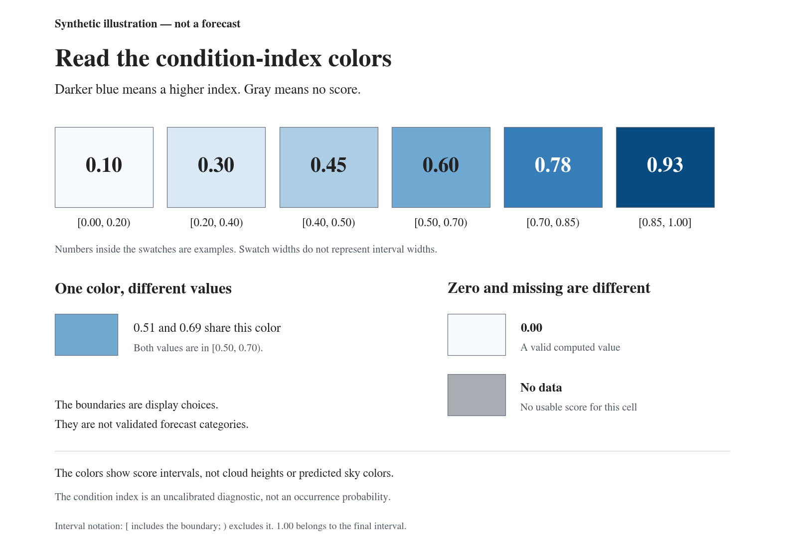
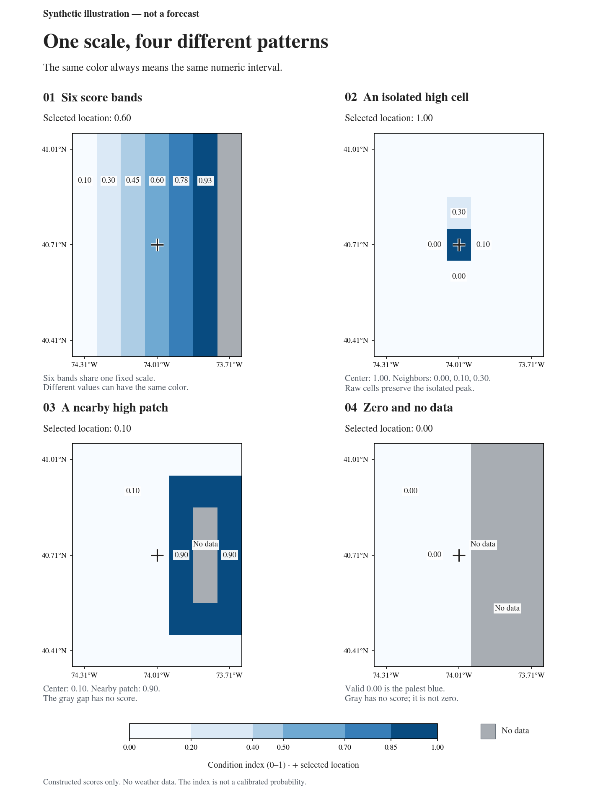

# Forecast color guide

These are **synthetic illustrations, not forecasts**.
The values are constructed numbers. No weather data were used.
The examples use the same palette and grid display as the forecast maps.

The colors show **score intervals**. Darker blue means a higher condition index.
Gray means that no score is available.
The colors do not show physical cloud layers, cloud amount, or sky colors.
The index is an uncalibrated heuristic. It is not an event probability.

## Read the scale



| Example value | Score interval |
| ---: | --- |
| 0.10 | `0.00 ≤ index < 0.20` |
| 0.30 | `0.20 ≤ index < 0.40` |
| 0.45 | `0.40 ≤ index < 0.50` |
| 0.60 | `0.50 ≤ index < 0.70` |
| 0.78 | `0.70 ≤ index < 0.85` |
| 0.93 | `0.85 ≤ index ≤ 1.00` |

An exact boundary uses the darker interval. The last interval includes 1.00.
Different values can have the same color. For example, 0.51 and 0.69 use the
same shade. Read the numbers when you need an exact comparison.

## Compare four examples



| Example | What to read |
| --- | --- |
| [All six bands](01-score-bands.png) | Read each shade with its exact score. Gray is outside the numeric scale. |
| [An isolated peak](02-isolated-peak.png) | A value of 1.00 stays in its cell. Nearby low values stay low. |
| [A nearby high-score area](03-nearby-patch.png) | The selected point has a low score. A nearby dark area has separate scores. |
| [Zero and missing data](04-zero-and-missing.png) | Zero is a computed value. A gray cell has no score. |

The crosshair marks the selected point. The four examples use the same coordinates,
grid, and scale. They do not describe the weather at those coordinates.
The maps preserve the input cells without smoothing or interpolation.
For real forecast cases, see [Shanghai](../shanghai-sunset/README.md) and
[New York City](../new-york-sunset/README.md).

## Generate the examples

Prerequisites: Python 3.11 or newer and the project environment.
Run these commands from the repository root. No weather downloads are required.

1. Install the locked environment:

   ```bash
   uv sync --frozen
   ```

2. Generate the gallery:

   ```bash
   uv run python examples/color-guide/generate.py
   ```

The command replaces only the gallery's generated files.
To save a separate copy, add `--output .local/color-guide-check`.
The [input values](values.json) contain the constructed cells and numeric labels.
JSON `null` identifies a missing value. These are example inputs, not forecast
metadata. The scripts do not request weather or map data.

## Design reference

The layout uses clear priorities, consistent spacing, and numbers with colors.
These design methods come from the
[GPUI Kit Design Guides](https://gpui-kit.com/docs/design-guides/).
The figures use Python and Matplotlib. GPUI Kit is not a runtime dependency.
