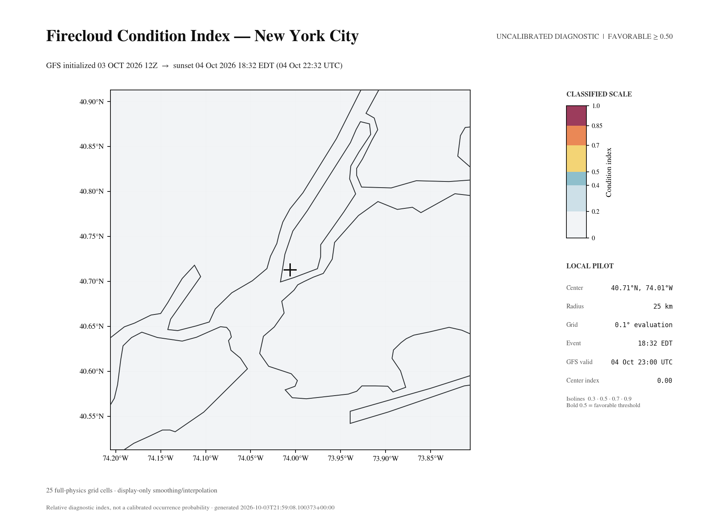

# New York City sunset pilot

This is a real local forecast for October 4, 2026. The example uses public
coordinates: 40.7128°N, 74.0060°W. It is an archived forecast, not an observation.
It does not establish forecast accuracy.



## Event and weather times

Times use Eastern Daylight Time (EDT) and Coordinated Universal Time (UTC).
Global Forecast System (GFS) is the weather model used for atmospheric profiles.

| Item | Time |
| --- | --- |
| Sunset | October 4, 18:32:48 EDT / 22:32:48 UTC |
| GFS initialization | October 3, 12:00 UTC |
| GFS forecast hour | `f35`: October 4, 23:00 UTC / 19:00 EDT |
| Open-Meteo selected hour | October 4, 23:00 UTC / 19:00 EDT |
| Product generation | October 3, 21:59 UTC |

The selected GFS forecast hour is 27.20 minutes
after the exact sunset time. The scoring geometry uses the sunset instant.
GFS cycle selection was fixed at October 3, 21:48:25 UTC for this measured case.
The [metadata](metadata.json) records this time and each source retrieval time.
The Open-Meteo provider model was not recorded. The metadata states this limit.

## Result and inputs

The center condition index is **0.00**. All 25 evaluation cells have an index of
0.00. The center has a gate score of 0.00 and a modifier score of 0.70.
A gate is a necessary condition. A modifier adjusts the quality of that condition.

The `sunward_illumination` gate is 0.00. It estimates whether sunlight can reach
the selected cloud layer. A zero gate makes the final index zero. The center
snapshot reports 100% low cloud cover and 100% high cloud cover. These are model
inputs, not observed cloud measurements. A zero index does not prove that a
colorful sunset will be absent.

The evaluation grid has 5 × 5 cells, a 25 km radius, and 0.1° spacing. GFS still
has 0.25° resolution. The shared weather cube includes the complete 800 km
sunward path for each cell. Its bounds are approximately 38.94–41.41°N and
84.05–73.31°W. Observer bounds do not clip weather paths.

This run has no terrain elevation provider or per-column aerosol provider.
It has visibility data for all 25 cells. It has no satellite correction because
Himawari coverage is unavailable for this region.

## Measured download and computation

The pressure-data transfer was 131,479,983 bytes and took 19.67 seconds.
The final generation used cached GFS data and took 4.91 seconds. Map data was
also cached. These are two separate measurements on one computer.
The transfer count excludes Open-Meteo requests. It is not a runtime estimate
for the default 945-cell grid.

The [capture file](capture.json) records the software revision, parameters,
weather bounds, measurements, and artifact checksums. Raw weather grids and
all per-cell snapshots are not included. The archive cannot replay the model.

## Check the archive

Prerequisite: Python 3.11 or newer with timezone data for `America/New_York`.
No weather download is required.

1. Open a terminal in the repository root.
2. Run this command:

   ```bash
   python examples/new-york-sunset/verify.py
   ```

The script checks file integrity, local date, model time, and product identity.
It does not check forecast accuracy.

## Request another forecast

Prerequisites: install the project as described in the main README. Allow weather
downloads. Choose a date available from the current providers.

1. Run this command with your chosen date and coordinates:

   ```bash
   uv run firecloud --region us-nyc --scope local --source local --event sunset \
     --lat 40.7128 --lon -74.0060 --radius 25 --resolution 0.1
   ```

This command uses today's New York date. Add `--date YYYY-MM-DD` to select
another date. It uses current provider data and will not reproduce this archive.

Weather data by [Open-Meteo.com](https://open-meteo.com/)
([CC BY 4.0](https://creativecommons.org/licenses/by/4.0/)), with GFS from the
National Oceanic and Atmospheric Administration (NOAA).
Map context made with Natural Earth. Firecloud produces a derived diagnostic.
